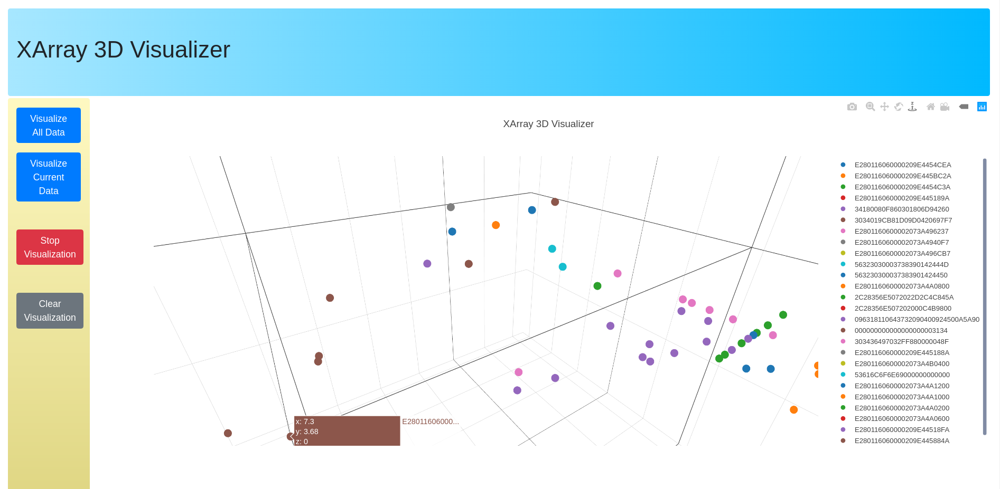

# XArray Visualizer

This project creates a 3D visualization from the data collected with the BellyBand's XArray interrogator. 

The visualization is created with Plotly, and has the following requirements:

* An internet connection (the CDNs will not load if you have no internet connection)
* The BellyBand API web server must be running.
* The database you are using contains **only** XArray data. 
* (Optional) - If you want the visualizer to plot new data, you must have the XArray client running



# Setup

First, you must run the BellyBand API web server. For the SQLite version, this can be done by running the following command in in the `/iot-sensor-framework/database` directory (https://github.com/drexelwireless/iot-sensor-framework). :

```
$ ./server.sh
```

Note that if the password for the webserver is different from the default password of `abc123`, you must edit the `index.html` file and change the `db_password` variable to the correct password.

After you have the BellyBand API web server running, you can optionally activate the XArray interrogator to stream data into your database by going to `/iot-sensor-framework/interrogator` (https://github.com/drexelwireless/iot-sensor-framework) and running: 

```
$ ./client_xarray.sh
```

Finally, you can now open the `index.html` file in either Firefox or Google Chrome, although Google Chrome is recommended.

# Running

After opening the `index.html` file, there are four buttons that you can click on.

* Visualize All Data
    * This will show all of the data in your database.
* Visualize Current Data
    * This will show all of the data that was populated into the database after the button was clicked. Any data populated before clicking this button will not appear. Use this if you only want to see the most current data.
* Stop Visualization
    * This will stop the visualization from updating, but will not delete the visualization.
* Clear Visualization
    * This will stop the visualization from updating, then it will delete the entire visualization. Use this option if you want to switch between the "Visualize All Data" and "Visualize Current Data" options, or if you simply want the visualization to disappear.
    
# Troubleshooting

Here are a list of common errors, which can be found in your browser's console:

1. You get an error involving SSL certificates
* Your web server likely does not have an SSL certificate. If you wish to run this visualizer without your server having an SSL certificate, you can do so on Google Chrome by visiting the webserver on your browser (https://0.0.0.0:5000), and clicking on "Advanced", and then "I understand the risks and wish to continue" button. This will allow your browser to send the HTTPS request even without an SSL certificate.

2. You get an error involving a failed request, or an unresolved promise
* Check the password set in the `db_password` variable in `index.html`. It needs to be the same password as the one used for your webserver. 

3. You get an error involving a missing field or key
* Check that your database does in fact have the XArray data in it, and that it does *not* have data from multiple different types of interrogators. The visualizer will not work if your database has multiple different interrogator data formats, or the wrong interrogator data format (it must be XArray).

4. You get a CORS (Cross-Origin Resource Sharing) error
* Check that you have run the `deploy.sh` file located in the Bellyband repository located at https://github.com/drexelwireless/iot-sensor-framework. If you get this error, it is likely because the `flask-cors` module was not properly installed. You can manually reinstall `flask-cors` by running `sudo pip3 install -U flask-cors`.
* If this does not work, you can bypass the CORS error in Google Chrome by running `google-chrome --disable-web-security` in your terminal. On Windows, you can do the same thing by running `C:\ProgramFiles\Google\Chrome\Application\chrome.exe --disable-web-security`, although your Google Chrome directory may vary.

5. You get an error about being unable to contact the server at https://0.0.0.0:5000, or a failed GET request.
* This usually means that the web server is not running. Try running the web server and then try again.. If the web server is not running, the visualizer will be unable to send a GET request to it.

6. Everything looks like vanilla HTML5 without styling (ie; no Bootstrap), and the graph doesn't load at all.
* Check that you have internet connection. This usually means that the CDNs for the Javascript libraries used in this visualizer did not load, which you can confirm by looking in your browser's console.
